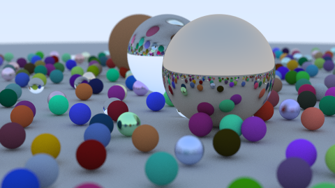

must be only empty folder

```bash
g++ * -o out
```

2 Output an Imgage : 30/08/2025

3 The vec3 Class : 30/08/2025

4 Rays, a Simple Camera, and Background : 31/08/2025

5 Adding a Sphere : 31/08/2025

6 Surface Normals and Multiple Obj : 03/09/2025

7 Camera : 03/09/2025

8 Antialiasing : 05/09/2025

9 Diffuse : 05/09/2025

10 Metal : 07/09/2025

11 Dielectrics : 07/09/2025

12 Positionable Camera : 09/09/2025

13 Defocus Blur : 09/09/2025

[source](https://raytracing.github.io/books/RayTracingInOneWeekend.html)
